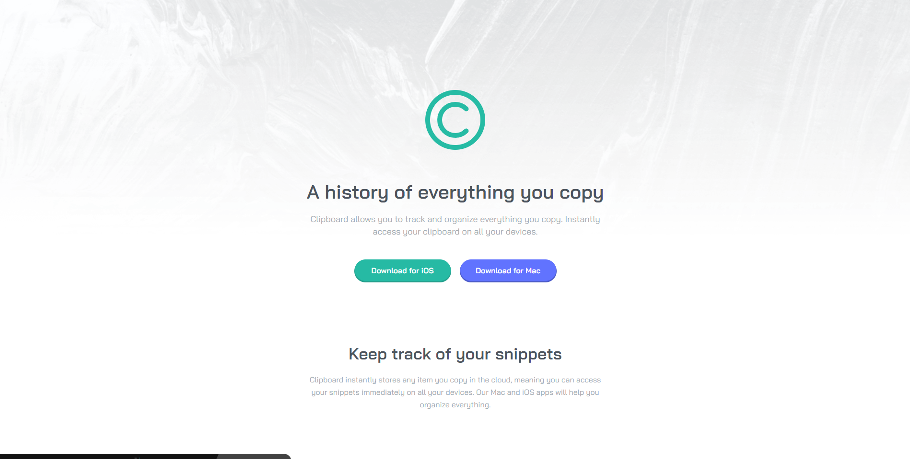

## Table of contents

- [Overview](#overview)
  - [The challenge](#the-challenge)
  - [Screenshot](#screenshot)
  - [Links](#links)
- [My process](#my-process)
  - [Built with](#built-with)
- [Author](#author)

## Overview

### The challenge

Users should be able to:

- View the optimal layout for the site depending on their device's screen size

### Screenshot

### Links

- Solution URL: [github.com/emanuelsaucedoa/clipboard-landing-page](https://github.com/emanuelsaucedoa/clipboard-landing-page)
- Live Site URL: [clipboard-landing-page-emanuelsaucedo.vercel.app/](https://clipboard-landing-page-emanuelsaucedo.vercel.app/)

## My process

### Built with

- HTML5
- CSS
- Flexbox

## Author

- Linkedin - [emanuelsaucedo](https://www.linkedin.com/in/emanuelsaucedo/)
- Github - [@emanuelsaucedoa](https://github.com/emanuelsaucedoa)